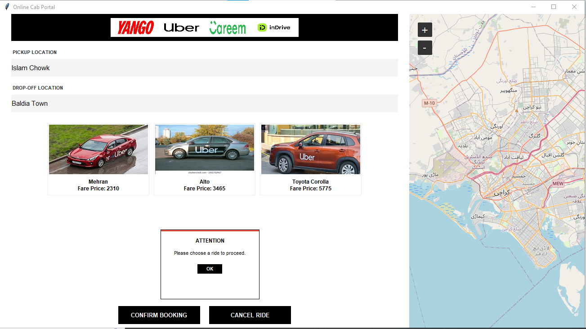
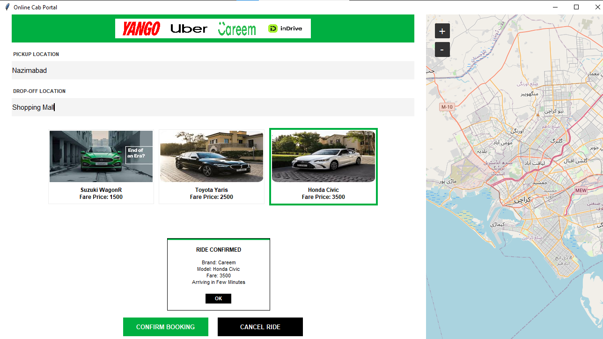
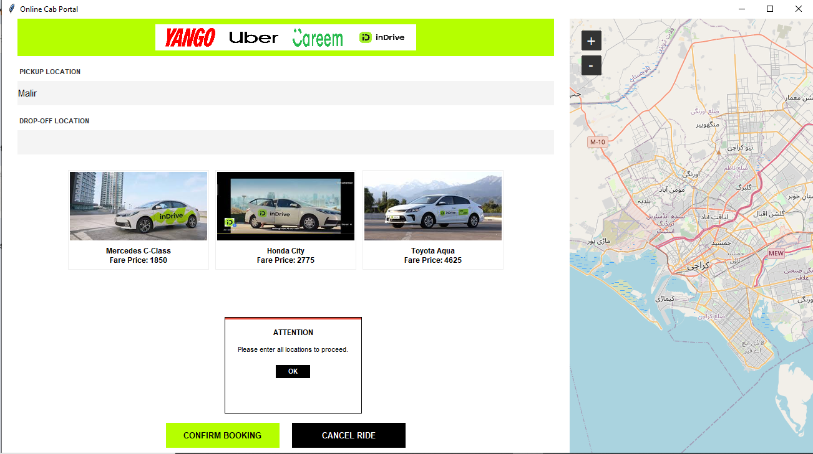

#  Online Cab Portal (Python Desktop Application)

The **Online Cab Portal** is a high-fidelity desktop application designed to streamline the ride-hailing experience. It allows users to compare fares and vehicle types across multiple top-tier service providers: **Yango, Uber, Careem, and InDrive**. The application features a dynamic UI that adapts its entire theme—including buttons, navigation bars, and alert popups—based on the selected service provider.

##  Key Features

* **Dynamic UI Theme**: The entire interface (navigation bar, buttons, and borders) switches colors instantly based on the selected brand (e.g., Neon Green for InDrive, Red for Yango).
* **Real-Time Map Integration**: Features an interactive map centered on Karachi using the `TkinterMapView` library.
* **Brand-Specific Fares**: Each provider has its own base fare and vehicle categories (Economy, Comfort, Luxury).
* **Custom Alert System**: Instead of standard Windows popups, the app uses a `show_custom_popup` function to display brand-colored alerts positioned precisely for better UX.

##  Application Themes

| Yango Style | Uber Style | Careem Style | InDrive Style |
| :---: | :---: | :---: | :---: |
| .png) |  |  |  |

## 🛠 Technical Stack & Libraries

This project is built using the following core technologies:

* **Language**: Python 3.13.x (Latest Stable Version).
* **GUI Framework**: Tkinter (Standard Python Interface).
* **Map Integration**: TkinterMapView (For real-time geographical visualization).
* **Image Processing**: Pillow (PIL) (For high-quality rendering of logos and vehicle assets).
* **IDE**: Visual Studio Code (VS Code).

## Input Validation & Safety Features

To ensure a professional user flow and prevent runtime errors, the application includes strict input validation:

* **Field Empty Check**: If the Pickup or Drop-off locations are left blank, a brand-colored "ATTENTION" popup is triggered.
* **Selection Enforcement**: The "Confirm Booking" logic verifies that a specific vehicle card has been clicked/selected before allowing the user to proceed.
* **Dynamic Hex-Code Alerts**: Alerts are not generic; they use the active brand's hex code for the top border and buttons to maintain visual consistency.
* **Positioned Alerts**: Confirmation popups are mathematically centered under the vehicle selection area for maximum visibility.

##  Installation & Setup

To run this project locally, follow these steps:

1. **Clone the Repository**:
   ```bash
   git clone https://github.com/samiyaasghar12-lgtm/Online_Cab_Portal.git

   Install Required Libraries:
   
   pip install tkintermapview
   pip install Pillow

   Run the Application:

   python main.py

   📂 Project Directory Structure
The project is organized for scalability and ease of use:

main.py: Contains the core application logic, fare algorithms, and UI definitions.

README.md: Project documentation and setup guide.

*_logo.png: Official brand assets used in the navigation bar.

*1.png, *2.png, *3.png: Categorized car images for each provider.

*_ss.png: Application screenshots for different brand themes.

